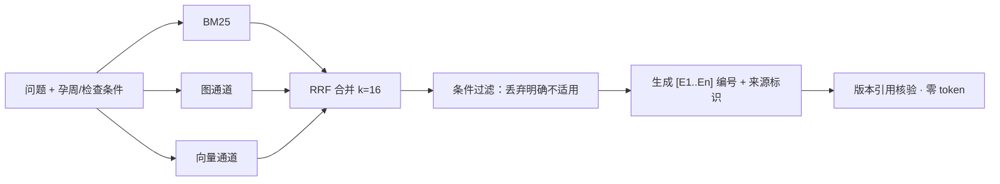

# PACE-RAG：产前超声条件化证据检索与可核验生成

**PACE**（Prenatal Applicability-Constrained Evidence，产前适用性约束证据）：
在孕周与检查条件约束下做证据集合检索与可核验生成——不只找语义相关片段，
而是找一组共同支持回答、条件适用、来源可定位、保留真实分歧的证据。

研究设计见 [docs/2026-09-12/prenatal-ace-framework.md](docs/2026-09-12/prenatal-ace-framework.md)
（主文档）及同日续记；实现进度见 [docs/2026-09-14/](docs/2026-09-14/) 与
[docs/2026-09-15/](docs/2026-09-15/) 的基础批次记录。

## 框架：四层

1. **证据真值层**（`prenatal_rag/evidence_store/`）：来源身份（manifest `source_id`、
   PDF SHA-256）、页/span 锚点与 chunk 文本只有一份真值；图与向量库是可重建投影，
   span 级引用只能由本层承担。
2. **适用性判断**（`prenatal_rag/applicability/`）：孕周以天存储（`22+3 = 157` 天，
   不是 22.3 周），对证据输出 Applicable / Inapplicable / Unknown 三值判断，
   不做隐式区间模糊。
3. **多通道检索**（`prenatal_rag/retrieval/`）：BM25、图、向量三通道各自只输出排名，
   由 `rrf.py` 合并为统一候选（k=16）；不直接相加未经校准的相似度。
4. **条件过滤与受控生成**（`prenatal_rag/conditions/` + `prenatal_rag_client`）：
   chunk 级条件抽取后，按题目查询条件丢弃明确 Inapplicable 的上下文（B1 显式过滤）；
   生成器使用 `[E1..En]` 编号证据与来源标识，并对版本引用做零 token 的一致性核验。



关键实验设计：**B0 冻结上下文 + B1 单变量对照**——B1 复用 B0 检索上下文，
只隔离"是否条件过滤"一个变量；任何检索侧改动都必须走运行时重检索臂才能被观测到
（见[批次十二](docs/2026-09-15/pace-foundation-batch-12.md) §1）。

## 评估结果

评分口径：`final` = 逐题均值，安全惩罚只在逐题层应用一次；Judge 开启后 selected
指标用 LLM-as-Judge（生成 `gpt-5-mini`、判分 `gpt-5`，另有说明除外），lexical 只作回归
baseline；两者保留，不替代 L3/L4 医学专家复核。

### 表 1 — PACE 内部：冻结基线、条件过滤、三通道（50 题）

| 配置 | final | P@16 | R@16 | coverage | faithfulness | completeness | correctness |
|---|---:|---:|---:|---:|---:|---:|---:|
| B0 冻结（`light_rag_pace_b0_20260914`，26/26 索引，Judge 无截断 50/50） | 0.9299 | 0.7887 | 0.96 | 0.9413 | 0.962 | 0.861 | 0.8946 |
| B0_ctrl（同上下文受控重生成） | 0.8795 | 0.7887 | 0.96 | 0.9413 | 0.9794 | 0.7574 | 0.9004 |
| B1（显式条件过滤；50 题中 2 题丢弃 6 条 Inapplicable 上下文） | 0.8815 | 0.7917 | 0.96 | 0.9413 | 0.9834 | 0.754 | 0.9088 |
| 运行时两通道（BM25+图，真值层锚点重检索再生成） | 0.8812 | 0.7812 | 0.94 | 0.957 | 0.981 | 0.7546 | 0.8788 |
| 运行时三通道（+向量） | 0.8823 | 0.8263 | 0.98 | 0.9627 | 0.965 | 0.7412 | 0.8944 |

- B0 产物冻结于 `benchmark/results/light_rag/pace-b0-evaluation-20260914.json`；
  B0_ctrl 与其同档（0.8795 vs 0.8812），属重生成方差。
- B1 只动"是否过滤"：final +0.0020，correctness +0.0084，faithfulness/completeness 基本持平。
- 检索层消融（离线、零 LLM）：三通道相对两通道 recall **+0.04**（2 题改善 / 0 题变差），
  coverage +0.0057，precision +0.045；向量通道独有锚点均值 6.9/题（50/50 题均 > 0），
  对冻结 B0 上下文的源级覆盖 0.6607 → 0.7208。见[批次十一](docs/2026-09-15/pace-foundation-batch-11.md)。
- 端到端配对 Δ（三通道 − 两通道，答案 50/50 全不同）：final **+0.0011**
  （25 改善 / 21 变差，噪声级）；correctness +0.0156，faithfulness −0.016，
  completeness −0.0134。recall +0.04 集中在 2 题（`PU-L3-024` R 0→1、final +0.1239；
  `PU-L4-001` R 0→1 但 final 不变，地板效应），其余 48 题 recall 完全相同、
  final Δ 均值 −0.0014。见[批次十二](docs/2026-09-15/pace-foundation-batch-12.md)。
- **结论**：层 N 的指标改善不自动抬高层 N+1；当 recall 已近天花板时，
  下一步是候选池对齐与上下文取舍，而非继续堆通道。

### 表 2 — 五框架 62 题历史合并（描述性，非统一受控实验）

50 道基线题 + 12 道新增题，每框架 62 份答案；历史模型设置以保存元数据为准，
执行日期/重试策略/安全评分入口不完全一致，不能声称统一受控实验或严格排名。
详见[合并报告](benchmark/report/framework-comparison-62-20260912.md)
（精确数值与源文件哈希见 `benchmark/results/preclinical-20260911/summary_62.json`）。

| 框架 | 总分 | Recall@16 | 生成均分 | 忠实性 | 完整性 | 正确性 |
|---|---:|---:|---:|---:|---:|---:|
| LightRAG | 0.894 | 0.968 | 0.876 | 0.848 | 0.852 | 0.877 |
| HippoRAG* | 0.889 | 0.935 | 0.848 | 0.895 | 0.768 | 0.831 |
| KAG | 0.861 | 0.903 | 0.840 | 0.750 | 0.825 | 0.871 |
| Microsoft GraphRAG | 0.817 | 0.871 | 0.799 | 0.620 | 0.824 | 0.860 |
| PathRAG | 0.603 | 0.323 | 0.755 | 0.471 | 0.851 | 0.855 |

\* HippoRAG PRE008 生成 Judge 解析失败：总分及生成指标只统计 61 题，Recall 统计 62 题。

### 表 3 — 50 题统一口径对照（同一评分框架 rescore；生成 `gpt-5-mini` / 判分 `gpt-5` / 向量 `text-embedding-3-large`）

| 框架 | recall@k | precision@k | 生成加权 | 正确性 | 安全 | **final** |
|---|---:|---:|---:|---:|---:|---:|
| LightRAG | 0.980 | 0.821 | 0.863 | 0.864 | 1.000 | **0.915** |
| KAG | 0.940 | 0.866 | 0.834 | 0.863 | 0.667\* | **0.882** |
| Microsoft GraphRAG | 0.900 | 0.681 | 0.772 | 0.837 | 1.000 | **0.843** |

\* KAG 的 PU-L4-002（家用 Doppler "reassure" 表述）被判真实违规。final 差距远超
dataset 级噪声带（±0.003），排序可信。详见[三框架对比](benchmark/report/three-framework-comparison-20260908.md)。

分架构类型（basic n=23 / multi-vector n=17 / graph-enhanced n=10；列为 recall / precision / faithfulness / final）：

| 类型 | GraphRAG | LightRAG | KAG |
|---|---|---|---|
| basic | 1.000 / 0.894 / 0.610 / 0.906 | 1.000 / 0.910 / 0.909 / **0.957** | 0.957 / 0.926 / 0.797 / 0.891 |
| multi-vector | 0.941 / 0.544 / 0.721 / 0.825 | 1.000 / 0.849 / 0.764 / 0.905 | 1.000 / **0.912** / **0.835** / **0.908** |
| graph-enhanced | 0.600 / 0.422 / 0.279 / 0.727 | **0.900** / 0.569 / **0.806** / **0.834** | 0.800 / **0.648** / 0.575 / 0.818 |

KAG basic recall 0.957 受 gold 源 `FDA-ultrasound-imaging` 缺失限制；
graph-enhanced 三框架的 PU-L3-024/027 gold 源（PMC/PubMed）均不在语料，recall 上限被锁。

成本与可靠性（50 题）：

| 框架 | LLM 请求数 | tokens | 成本 | 耗时 | 失败 |
|---|---|---|---|---|---|
| GraphRAG | 1410（每题 ~28） | 1.04M | $0.56 | 141 min | 0 |
| LightRAG | **50** | 0.23M | $0.53 | **47 min** | 0 |
| KAG | 227–243 | 1.9–2.6M | $0.53–0.55 | 64–68 min | 0 |

GraphRAG drift 路径 faithfulness 崩塌（0.279）——答案主要来自预生成的社区摘要而非检索证据；
KAG precision 全场最高，但 solver 多步生成的 faithfulness 偏低、token 成本最高。

### 数据约束

- 现有 50 题中安全题仅 3 题、跨指南题仅 1 题：结果仅支持技术选型，不能证明临床可用。
- 原始语料覆盖 50 题中的 45 道；缺少 `FDA-ultrasound-imaging`、`PMC-3410507`、
  `PubMed-24258515`（对应 PU-L4-001~003 与 PU-L3-024/027 的 recall 上限被语料锁定）。
- 33 份 PDF 去重后得到 32 份 GraphRAG 输入文档；40 道扩充题仍为 `pending` 标注，
  L3/L4 结果需要医学专家复核。新增 6+6 道安全/跨指南挑战草案待专家审核；
  来源核实、隐藏验收集和上线判定见[上线前评测与审核方案](benchmark/qa/dataset/PRECLINICAL_REVIEW.md)。
- 12 道新增题（6 安全 + 6 跨指南）逐题 Judge 分与行为复核见[全量 60 条记录](benchmark/report/preclinical-full-60-20260912.md)；
  增量评估过程见[增量评估报告](benchmark/report/preclinical-incremental-20260911.md)。

## 运行

```bash
uv sync

# PACE B1 双臂受控生成（复用冻结 B0 上下文；--dry-run 为零 token 管道验证）
uv run python -m benchmark.baseline.prenatal_rag_client.benchmark \
    --results benchmark/results/light_rag/pace-b0-evaluation-20260914.json \
    --judge-mode optional
```

各基线客户端均暴露 `index` / `evaluate`；GraphRAG、LightRAG、PathRAG、KAG 另有
`prepare` / `preflight` / `run`，HippoRAG 另有 `preflight`（无 `prepare` / `run`）。
密钥只读 `benchmark/.env`（`RAG_*` 变量共用；`.env.example` 为无密钥模板）；
语料统一读 `benchmark/data/corpus/input/` + `corpus_manifest.json`，
结果统一写 `benchmark/results/<baseline>/`。Judge 与模型覆盖参数见各客户端
`evaluate --help`（PACE 为 `--judge-mode off|optional|required`，默认 `off`）。

验证：`uv run --with pytest python -m pytest tests/ -v`；
门禁：`bash benchmark/report/oldcoder_gauntlet.sh`（测试 + ruff + pyright + 覆盖率 + 变异 + 真实执行）。

## 代码架构

```
prenatal_rag/             # PACE 研究包（不依赖 benchmark.*）
├── evidence_store/       # 证据真值层：来源身份、页/span 锚点、chunk 文本（SQLite）
├── applicability/        # 孕周以天解析与三值适用性判断
├── retrieval/            # BM25/图/向量三通道（只输出排名）+ RRF 合并
├── conditions/           # chunk 级条件抽取、GaWindow、三值分类与 B1 过滤
├── evidence/             # 证据选择、版本引用核验与 supersession
benchmark/
├── common/               # 共享评测逻辑：语料/清单、usage、答案归一化、检索上下文抽取、来源校验
├── config/               # 框架无关的环境变量解析
├── qa/                   # 数据集 schema、三层评分、LLM-as-Judge
├── baseline/             # 五基线客户端 + PACE 评测客户端（B0 冻结上下文 + B1 双臂）
├── data/corpus/input/    # ★ 唯一输入语料 + corpus_manifest.json
└── results/              # 评测结果（按基线分子目录）
tests/                    # pytest 测试（与源码结构对应）
docs/                     # 研究设计（2026-09-12）与基础批次进度（09-14/09-15）
```
