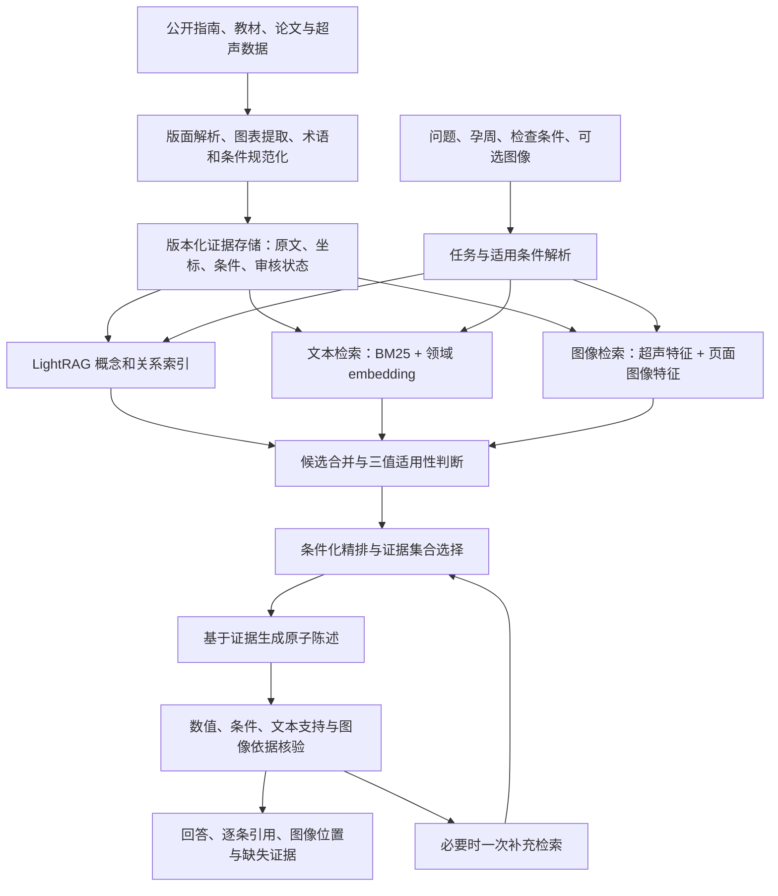

# PACE-LightRAG：产前超声的条件化证据检索与可核验生成

研究设计日期：2026-09-12。联网检索与原始来源核验截至同日。工作名称中的 PACE 指 Prenatal Applicability-Constrained Evidence；名称唯一性已于同日初步核验（RAG/医学检索方向无直接碰撞，但医学领域 PACE 缩写拥挤，标题应用全称），见[探索续记 §3.1](./prenatal-ace-framework-followup.md)。本文是待实现、待实验验证的研究方案，不是已完成的算法或实验结果。

## 1. 研究结论与范围

建议基于现有 LightRAG，研究**孕周与检查条件约束下的证据集合检索**：系统不只找到语义相关片段，而是找到一组共同支持回答、条件适用、来源可定位且保留真实分歧的证据。生成器根据证据组织回答，独立核验每条临床陈述。

三个相互关联的研究贡献候选：

1. **条件化证据表示与集合选择**：将孕周、人群、检查类型、切面、测量方法、指南条款版本纳入证据适用性；检索目标从片段相关性扩展为证据集合的支持覆盖与条件一致性。
2. **条件敏感的领域检索训练**：训练文本 embedding / reranker 区分“内容相似且适用”“内容相似但明确不适用”“条件缺失”；用有依据的条件变化题和保持不变题验证。
3. **图文联合支持的逐陈述核验**：区分来源原文、教学图片、患者图像观察和模型推断，检查输出是否同时具备内容依据、适用条件和正确的图像证据角色。

这些是创新假设。时间过滤、事件图、图文对齐、难负例、LoRA、逐句引用和证据账本都有先例；不能凭组合声称“首次”或“最先进”。其中第 1 项应成为论文主线，第 2 项提供可训练算法，第 3 项用于检验系统是否减少不适用证据导致的错误。

用户明确的训练资源是 **6×RTX 3090，每卡 24GB，CUDA 12.4**。数据基础是可获得的公开指南、教材、论文和公开超声图像资源；目前没有确认具备真实孕周、配对报告及同一胎儿多次随访的纵向数据。

当前能验证的是指南知识问答、孕周适用性、版本选择、教学图像检索、切面和结构证据定位。患者病程演化和预后留作后续数据扩展；合成随访只能测试软件规则，不能证明真实病程推理能力。

## 2. 近期方法与我们的差异

表中日期为论文发表或预印本日期；官方代码动态更新单独注明。所有方法效果均来自原作者研究，不能直接迁移为本项目的效果承诺。

| 已核验来源 | 时间 / 状态 | 可复用的能力 | 对本项目的限制与差异 |
|---|---|---|---|
| [LightRAG](https://arxiv.org/abs/2410.05779)；[官方代码](https://github.com/HKUDS/LightRAG) | 2024-10；代码核验至 2026-09-12 | 图与向量检索、低层与高层检索、增量索引；当前版本已有引用及多模态管线 | 需自行建立临床条件、原始证据锚点和逐陈述支持规则 |
| [RAG-Anything](https://arxiv.org/abs/2510.12323) | 2025-10，技术报告 | 跨模态关系与文本语义双图、图文表公式检索 | 官方 LightRAG 已集成相关能力；“给 LightRAG 加图片”不是原创贡献 |
| [PathRAG](https://arxiv.org/abs/2502.14902) | 2025-02 | 关系路径剪枝，减少图检索冗余 | 路径存在不等于临床结论被证明；每条关系仍需原文支持 |
| [HippoRAG 2](https://arxiv.org/abs/2502.14802) | 2025-02 | 段落集成、关联检索与非参数记忆 | 可作已有基线；不是孕周适用性或患者纵向有效性的现成方案 |
| [E²RAG](https://aclanthology.org/2026.eacl-long.90/) | EACL 2026-03 | 区分实体 mention，实体—事件图保存叙事和时序关系 | 主要在小说等叙事语料验证；原文 vanilla 版本并非普遍优于 LightRAG，不能简单宣称替换必有收益 |
| [TimelyRAG](https://arxiv.org/abs/2609.11572) | **2026-09-10，预印本** | 修订文档的条款时间区间、语义与时间重排、未来文档约束 | 法规政策场景；孕周是生理时间，医学指南的发布日期也不自动等于临床生效日 |
| [EvoTrustRAG](https://arxiv.org/abs/2608.07933) | **2026-08-08，预印本** | 原文 span 支持的冲突图，区分知识演化、干预与未决冲突 | 冲突图及保留分歧已有先例；我们需验证孕周、人群、切面条件与图文支持的联合约束 |
| [MedCache](https://arxiv.org/abs/2608.29528) | 2026-08，预印本 | 临床纵向记忆的时间有效性与多专科检索 | 可作为将来纵向模块的参考；当前没有相应数据，不能复刻其临床主张 |
| [ReClaim](https://aclanthology.org/2025.findings-naacl.55/) | Findings NAACL 2025-04 | 引用与陈述交替生成，细粒度引用 | 先引用后生成已有先例；引用仍需检查内容与条件支持 |
| [SourceCheckup](https://www.nature.com/articles/s41467-025-58551-6) | Nature Communications 2025-04-16 | 区分 URL 有效、单条陈述支持和完整回答支持 | 对本项目最直接的启示：真实文献链接不代表回答全部有依据 |
| [Qwen3 Embedding](https://arxiv.org/abs/2506.05176) | 2025-06-05，技术报告 | 0.6B / 4B / 8B 文本 embedding 与 reranker，多语言 | 适合领域微调；数值边界与适用范围仍需显式结构化处理 |
| [Qwen3-VL-Embedding / Reranker](https://arxiv.org/abs/2601.04720) | **2026-01-08，技术报告** | 2B / 8B，文本、图像、页面和视频检索 | 强通用多模态基线；通用检索成绩不能证明胎儿超声识别能力 |
| [FetalCLIP](https://www.nature.com/articles/s41746-026-02907-9) | **npj Digital Medicine 2026-06-20** | 胎儿超声领域视觉语言骨干，[代码及权重入口](https://github.com/biomedia-mbzuai/fetalclip) | 训练图文对主要使用模型生成 caption，并非真实报告；训练图像不等于全部公开 |
| [FADA](https://arxiv.org/abs/2606.11106) | 2026-06-09，预印本 | 选择性教师特征蒸馏、离线缓存、轻量适配 | 数据开放状态与标签真实性需按原始记录核验；不是本项目可直接使用的完整训练集 |
| [AnatoProto](https://arxiv.org/abs/2608.27051) | 2026-08-27，预印本 | 解剖引导、冻结骨干、扫查内原型监督 | 解剖加权和冻结骨干已有先例；扫查内帧序列不等于跨孕周随访 |
| [ColPali](https://arxiv.org/abs/2407.01449)、[Nemotron ColEmbed V2](https://arxiv.org/abs/2602.03992) | 2024；2026-02 | 页面图像多向量检索与 late interaction | 适合教材图表版面检索；页面理解和超声解剖识别需要不同评测 |

这是针对本项目的定向研究梳理，不是覆盖全部论文的系统综述。特别是 2026-08/09 的预印本，应先作为实验比较方法，不能仅凭新近发布日期判定优于成熟方法。

## 3. 项目现状与直接复用点

仓库已有五框架基线、统一语料 manifest、来源 ID、PDF SHA-256、页码文本标记和评测协议。语料身份已于 2026-09-12 修复并重跑：33 份 PDF 按"页首 DOI ＋ 哈希"归并为 26 篇文章的单份索引文本（7 条去重记录，ISPD 文件名错位已更名），并查明历史基线实际索引 35 份文本（含 3 份陈旧残留）；见[审计报告](./prenatal-corpus-audit-20260912.md)。现有材料足以开始验证指南证据流程，但不等于已经具有临床图文训练集。

- `benchmark/baseline/light_rag_client/client.py` 已支持 embedding、LLM、reranker 注入和 `aquery_data`，可在外层实现领域模块。
- vendored LightRAG 为 1.5.7，已经包含 MinerU / Docling / VLM 多模态处理能力。当前项目使用的 `pypdf → text → ainsert` 路径尚未接入这些能力。
- `benchmark/common/corpus.py` 的文档哈希、`unified_corpus.py` 的来源清单可以继续用；需新增规范化 page、span、bbox、图号及图像资源记录。
- `benchmark/qa/schema.py` 已有孕周窗口与版本关系类型，但尚不足以执行数值区间适用性判断。
- 当前来源类别不能直接当临床证据等级。应拆开来源组织、管辖范围、研究设计、推荐强度和适用情境；国际指南不自动高于本地规范。

[62 题历史汇总](../../benchmark/report/framework-comparison-62-20260912.md)明确不是统一受控实验。新框架应新增基线身份与索引 namespace，保留历史结果。[增量评测报告](../../benchmark/report/preclinical-incremental-20260911.md)还发现 Judge 上下文截断等问题：评价必须使用实际生成时的证据包，不能仅取长上下文前若干字符。

## 4. 总体架构：独立证据存储 + LightRAG 检索投影



证据真值层推荐 PostgreSQL（原型可 SQLite）保存版本与事务，文件系统或对象存储保存原始材料；LightRAG 图及向量库是可重建投影。不要将 LLM 合并后的实体描述作为唯一医学依据。

本地 `ainsert_custom_kg` 文档明确说明该写入路径缺少完整的持久操作 journal 与文档恢复锚点。若使用它投影自定义图，应先提交证据存储和 outbox，再做幂等索引、记录完成状态并支持重放。新增/撤回来源时，失效的是该来源的支持关系；若另有独立证据支持同一结论，不应直接删除结论。

### 4.1 证据单元

核心节点不是只有“器官—疾病”三元组，而是有上下文的 `ClinicalStatement`。同一概念可以合并，来自不同人群、孕周、切面或版本的陈述必须保留独立身份。

| 对象 | 关键字段与作用 |
|---|---|
| `SourceDocument` | source_id、DOI/URL、文件哈希、标题、版本、发布组织、发布日期、获取时间、使用许可记录 |
| `EvidenceAnchor` | PDF 物理页与印刷页、原文字符区间、bbox及坐标系、图号/表号/单元格、解析版本、原文哈希 |
| `ClinicalStatement` | 原始命题、否定与不确定性、主语/对象、数值与单位、适用条件、来源锚点、抽取与审核状态 |
| `Applicability` | 孕周区间及开闭边界、胎数/绒毛膜性、人群风险、检查目的、切面/方法、地区适用说明、版本替代范围 |
| `ImageAsset / EvidenceRegion` | 图像哈希、原图/裁剪变换、图像类型、全图或ROI指针、原始图注、区域标注来源 |
| `Observation` | 原始人工标注或模型观察、所属图像/区域、模型版本、质量与校准信息；不能与原文事实混为一谈 |
| `ExamEvent`（后续） | pregnancy_id、fetus_id、检查时间、当次记录孕周及定孕周依据、图像/报告、测量值及方法 |
| `AnswerClaim` | 陈述文本、使用条件、引用的 statement/anchor、支持关系类型、核验结果 |

支持关系应区分 `SUPPORTED_BY`、`CONTRADICTED_BY`、`ILLUSTRATED_BY`、`DERIVED_FROM`、`APPLIES_UNDER`、经核验的 `SUPERSEDES`。推断出的边标记为推断，不能升级为原文断言。

同一出处的正文与图注可以互补，但不是两份独立研究证据。证据独立性按来源家族与原始研究追踪，避免教材转引同一论文后虚增支持数。

### 4.2 时间必须拆开建模

1. **孕周时间**：以天存储，`22+3 = 157 天`，不是 22.3 周；保留输入精度、估计区间和定孕周依据。
2. **医学知识有效性**：分别记录发布日、明确采用/生效时间、被替代的条款范围；未知即未知，不从年份猜测废止关系。
3. **系统可见时间**：首次获得材料及各次版本写入时间，用于重放“当时系统知道什么”，不能当成指南生效日。
4. **患者事件时间**：将来才用于同一胎儿跨检查比较；不能用当前孕周覆盖历史观测。

知识时间与系统时间可采用双时态存储；孕周作为独立生理适用轴。历史评测应说明是在重建“当时公开知识”还是“当时系统知识”，分别执行出版/公开截止与系统快照约束。

`applicability(q, e) ∈ {Applicable, Inapplicable, Unknown}`。明确不适用的材料不能支持当前个体建议，但可作为比较或解释材料。缺失绒毛膜性、测量方法或可靠孕周时，保留 Unknown；模型预测不能补成事实。输入孕周区间跨越规则边界时，也不能只取中点判断。

一般知识问答可以明确列出条件分支，例如“若属于某人群，则该条款如何规定”；这不等于认定用户已经满足条件。Unknown 限制的是无条件套用，不能成为拒绝解释已有指南知识的理由。

孕周不是统一的疾病阈值。已核验的 ISUOG 来源展示了条件差异：[2023 早孕指南](https://doi.org/10.1002/uog.26106)讨论 11+0–14+0 周检查；[2022 中孕指南](https://doi.org/10.1002/uog.24888)讨论约 18–24 周；[2024 晚孕指南](https://doi.org/10.1002/uog.27538)的时点受指征、母胎风险及本地条件影响；[2025 双胎指南](https://doi.org/10.1002/uog.29166)的监测频率依赖绒毛膜性。这些须按具体条款抽取，不能压缩成全局硬编码规则。

同样，“未显示”“未检查”“未发现异常”“结构不存在”要保留不同状态。未来如有纵向数据，应使用相同胎儿标识、同单位与相容测量方法进行比较；晚期胎儿尺寸不能自动用于覆盖已可靠确定的孕周。

## 5. 核心算法：条件化证据集合检索

### 5.1 检索流程

1. 将问题解析为检索意图、已知条件、未知条件及必需证据角色。例如“这张图是否支持某观察、相关指南如何解释”，需要图像观察证据和适用的指南依据。
2. 并行召回 BM25、文本 embedding、LightRAG 图关系和适当的视觉索引。先用 RRF 合并候选排名，避免直接相加不同模型未经校准的相似度。
3. 从真值层补齐每个候选的条件与原始来源。硬规则只判断有明确依据的数值、身份与适用性；其他条件由经过校准的小模型提出分类，保留未知。
4. 用领域 reranker 评估语义相关性、对必需证据角色的支持以及条件适用性，再选择证据集合。
5. 分别输出“可直接支持”“补充背景”“适用性未知”“真实分歧/版本比较”证据。分歧材料不会因为影响答案简洁而被删除。
6. 生成原子陈述并核验。若存在可补齐的证据缺口，进行一次有明确目标的补充检索；仍不足则限定回答范围。

所有 top-k、跳数和 token 上限属于开发集上调优的超参数。初始可试每路召回 20–40 条、图扩展 1–2 跳、精排后 8–16 条；这些不是效果保证，也不是临床阈值。

必需证据角色应由经核验的任务模板与原始条款定义；LLM 可以提出待检查的角色，但不能自行把某项额外检查升级为临床必需。必须把角色规划准确率纳入失败分析。

### 5.2 集合目标

令 R(q) 是回答问题需要的证据角色，E 是召回候选，S 是选出的证据集合，B 是固定上下文预算。为每个候选保留使用角色，只有适用、能回溯到与角色相符的原始材料并通过相应支持检查的证据，才可以承担直接支持角色。指南建议需要原文，视觉观察需要原图/区域及可用标注或经过评估的观察模型。

推理时，R(q) 来自经核验的模板与角色规划模块；coverage 来自候选—角色匹配器，互补支持来自类型规则及经开发集训练/校准的配对模型。选择阶段评估的是计划支持的陈述与证据角色，实际生成陈述仍须后置核验。测试集专家角色和支持标注不作为系统输入；使用这些标注的实验只能另列为 oracle 上界。

```text
S* = argmax over S ⊆ E:
       Σ[r ∈ R(q)] w_r · coverage(r, S)
     + α · Σ[e ∈ S] relevance(q, e)
     + β · complementary_support(S)
     - γ · redundancy(S)
     - δ · incompatible_joint_use(S)

subject to:
    context_cost(S) ≤ B
    每个直接支持节点能解析到原始证据锚点
    每条直接建议的必要条件已满足
    比较/冲突证据不得伪装成同一适用情境的共同支持
    若已检出影响答案的未决冲突，保留双方证据或显式声明缺失
```

`coverage` 衡量必需角色的证据覆盖，不能简单用“找到了多少实体”替代。`complementary_support` 衡量不同角色的互补，例如合规切面/观察证据与解释该观察的指南；不把多次转载当独立支持。`incompatible_joint_use` 惩罚的是把互不适用的证据一起用于同一结论，**不是惩罚真实分歧的呈现**。

起步用贪心的“单位预算边际收益 + 条件约束检查 + 冲突角色补全”。互补项和冲突约束使目标不一定是次模函数，不声明通用近似最优保证。在小候选集合上与穷举或整数规划结果比较，量化启发式选择损失；再评估端到端成本与收益。

这里与 LightRAG + metadata filter 的关键区别可检验：过滤只去除不适用片段，集合选择还要避免重复占用预算、补齐回答所需的多种证据角色，并识别不能被拼成同一建议的材料。若集合方法不优于简单过滤，应降低创新主张并保留较简单实现。

### 5.3 图文处理与核验

保留两种视觉入口：**页面图像**用于寻找图表与其上下文，**超声图像/ROI**用于切面与结构检索。相似教材图片可以解释一种征象，不能证明用户图像也具有该征象。

逐陈述核验执行三类检查：

- **来源与数值检查**：证据 ID 可解析；单位、数值对象、分母、范围、不等式方向和参考曲线一致；表格阈值必须保留表头及脚注。
- **语义与条件支持**：原文支持该陈述，已知条件相容；关键缺失条件不能由生成器补全。小模型 NLI 是辅助检查，结果允许无法核验。
- **视觉支持**：确实引用了相关原图/区域，图像质量与切面允许作出该观察。区域指针证明引用了哪里，不证明模型看对了；注意力热图不作为定位真值。

显示给用户的是结论、必要条件、原文引用和图像证据位置。系统内部另存模型版本、检索排名、证据包哈希和核验日志；无需展示自由生成的推理过程。

## 6. 公开数据：可立即使用与尚不可依赖的部分

| 数据来源 | 本次核验的可用性 | 适合的任务 | 不能据此声称的能力 |
|---|---|---|---|
| 项目现有指南、公开论文及有许可的教材材料 | 需逐来源保留版本与许可；公开访问不等于可再分发全文或训练图片 | 条款抽取、版本检索、图注对齐、图表问答 | 不自动提供真实患者报告、真实纵向病程 |
| [FETAL_PLANES_DB](https://zenodo.org/records/3904280) | 官方 open，CC BY 4.0；含切面、患者编号、设备/操作者等 | 切面检索、同切面难例、跨设备测试 | 无真实孕周、配对报告或跨孕周随访标签 |
| [HC18](https://zenodo.org/records/1322001) | 官方 open，CC BY 4.0；图像、像素尺寸和头围标注 | 测量与区域证据定位 | 没有真实孕周，不能将头围反推孕周当真值 |
| [FOCUS](https://zenodo.org/records/14597550) | 官方记录 **300 张四腔心图**，open，CC BY 4.0 | 心脏/胸廓区域与生物测量 | 不是完整先心病诊断集，也不是 1500 张早孕图 |
| [ACOUSLIC-AI](https://acouslic-ai.grand-challenge.org/) | 按挑战平台核验下载与使用条件 | 腹围盲扫的帧选择与分割 | 单次扫查内时序不是病程纵向；FGR 诊断超出官方任务范围 |
| [FETAL-GAUGE](https://arxiv.org/abs/2512.22278) | 论文描述 42k+ 图、93k QA；核验时仍说明录用后公开 | 作为待开放的评测参考 | 不能计入已获取训练/测试规模 |
| [FADA 数据记录](https://zenodo.org/records/20104811) | API 显示 restricted，公开 files 为空 | 学习其蒸馏方法，另行确认访问 | 不能按 README 的“公开”概括视为可立即下载；视觉估计孕周不是真实定孕周 |

FetalCLIP 的 210,035 图文对中，207,943 张临床图主要通过 GPT-4o 结合标签、孕周等生成 caption，另有 2,092 教材图文对。不能写成“210k 真实超声报告配对”。其对 HC18 的孕周相关结果是参考曲线一致性意义的 validity，并非有真实孕周标签的预测准确率。

构建数据时区分四层监督：原始人工标注、专家新增标注、原始图注弱监督、模型生成伪标注。模型 caption 附带教师/提示/来源版本，不能自行变为临床事实；教材全图图注也不能自动变为 ROI 真值。

## 7. 微调方案：优先检索与精排

### 7.1 模型优先级

| 模块 | 第一阶段选择 | 有增益后扩大 | 原因 |
|---|---|---|---|
| 文本 embedding | Qwen3-Embedding-0.6B，原模型与 LoRA 对照 | Qwen3-Embedding-4B LoRA | 数据量比参数规模更关键；先确认条件困难样本带来有效收益 |
| 文本精排/支持检查 | Qwen3-Reranker-0.6B 或专门小交叉编码器 | 4B reranker / 2–4B 结构化核验模型 | 对高相似但不适用证据进行细粒度判断 |
| 超声视觉检索 | 冻结 FetalCLIP，缓存特征 | 经核验图文/ROI监督下的小头或轻量适配 | 复用领域视觉特征；避免从少量公开图像重训视觉骨干 |
| 通用多模态对照 | Qwen3-VL-Embedding-2B 原模型 | 有足够配对数据再 LoRA | 可处理中文、多模态混合查询，作为强对照 |
| 视觉页面检索 | Qwen3-VL-Embedding-2B | 需要时引入 ColPali/ColEmbed 类多向量分支 | 先证明页面支路解决了文本解析丢失的问题 |
| 答案生成 | 沿用固定生成模型，版本与提示冻结 | 等检索收益清楚后再考虑生成器适配 | 便于把增益归因到我们的检索算法 |

若只能微调一个模型，优先微调文本 embedding；如果 pilot 显示召回已经很好而错误集中于候选排序，优先改为微调 reranker。暂不把主要预算投入自由生成式诊断模型。

不要直接拼接 Qwen 与 FetalCLIP 向量。第一阶段让各自使用自己的查询编码器，最后融合排名。FetalCLIP 英文文本空间与中文问题间可使用经审校的双语术语描述，并评估翻译损失；只有获得可信配对监督后再训练跨空间投影。

### 7.2 训练样本与损失

每条训练记录包含 `(query, conditions, positive_evidence_ids, negatives, labels, provenance)`。正例可以是互补的多条证据；批内不要把另一条有效正例误当负例。

困难负例来自原文确认的条件差异：词面相似但孕周适用范围不符；同孕周但单/双胎或检查类型不符；旧条款被新条款在同一适用范围明确替代；测量名称相近但单位或方法不符；图像切面无法支持所需观察。

同器官不同孕周、不同切面或指南年份不同**不天然构成负例**。跨切面材料可能正是必需补充证据；没有真实孕周标签的图像不能训练真实孕周判别。模糊样本使用 Unknown、软标签或排除。

```text
L = L_multi_positive_contrastive
  + λ_app · L_applicability(Applicable / Inapplicable / Unknown)
  + λ_pair · L_supported_condition_pairs
  + λ_distill · L_teacher_ranking     # 可选，单独消融
```

对比损失学习相关证据；适用性损失学习已标注的条件状态；配对损失约束有依据的条件变化应改变排序，条件无关的变化应保持结果稳定。embedding 上可增加训练期辅助头，显式条件仍由检索阶段检查；不能希望向量距离精确实现所有医学区间约束。

多正例对比项可使用 `-log[Σ(p∈Pq) exp(s(q,p)/τ) / Σ(d∈Pq∪Nq) exp(s(q,d)/τ)]` 作为起点。若它过度偏向容易的正例，应比较逐正例平均的 supervised contrastive 形式，并按必需证据角色报告召回。确认为真负例的条件样本可提高采样权重；权重与温度只在开发集调优。

视觉训练若缺少可信图文对，只做公开标签支持的切面/区域任务，不强行训练图像—指南临床命题对齐。图像裁剪、翻转和增强须保持标签语义；左右、胎位和测量标记相关任务不能不加区分地翻转。

### 7.3 6×3090 的执行配置

24GB×6 是六张卡的总容量，DDP 不会让一个进程自然获得 144GB。DDP 适合模型单卡放得下时扩大全局 batch；FSDP/ZeRO 用于需要分片的状态。LoRA 减少训练参数和优化器状态，但不能消除长文本与图片激活显存。

建议从以下**待显存实测的起始配置**开始：

- 0.6B 文本 embedding：BF16（确认运行环境支持）、LoRA rank 16，长度 512 起步，单卡 micro-batch 8，梯度累积 4；再根据有效证据跨度扩至 1024/2048。六卡 DDP 每次优化更新累计查询数示例为 `8×4×6=192`，但普通梯度累积不会让四个 micro-step 共享负例；跨卡合并时每步通常只有 `8×6=48` 条查询及其关联文档。更大负例池需另用 GradCache 或明确设计的队列，每查询的多文档还会增加显存。
- 4B 文本或 2B 多模态：LoRA 或 QLoRA，gradient checkpointing，micro-batch 1–2 起步；显式限制图像分辨率与 image token，不直接使用模型最大上下文。
- 跨卡负例需要实现带正确梯度语义的 all-gather，按来源与正例 ID 屏蔽重复和假负例；缓存负例要记录 encoder 版本及刷新策略。
- 冻结视觉教师按文件分片在六卡上离线提特征，避免每步重复计算。训练不同模型的探索实验可以分卡并行，不必所有任务都占六卡。
- 使用与驱动兼容的 PyTorch CUDA 12.4 环境；先验证 torch/CUDA、BF16、bitsandbytes 与注意力实现，再固定依赖。CUDA 工具包版本不能替代驱动、库及算子兼容检查。

验收训练可运行性时记录单卡峰值显存、吞吐和实际样本长度分布，再扩大多卡。本文未运行训练，因此不承诺小时数、最终 batch 或 8B 全参数训练可行性。

## 8. 评测：证明适用性收益，而不只提高总分

### 8.1 数据集划分

第一版可规划 300–500 道经审核的文本/图表问题，另建 100–200 道有真实标注支持的图像证据任务；这是标注工作量目标，最终规模应由 pilot 方差、效果大小和专家资源决定。题目按以下类别覆盖：

- 原文证据定位、单位/否定/表格脚注。
- 孕周边界、输入不精确、胎数/绒毛膜性和检查目的缺失。
- 指南更新、部分替代、本地与国际补充、真实冲突及未知版本状态。
- 图文匹配、切面不足、模型描述与人工标注不一致。
- 只改变一个适用条件的配对题，以及条件改变但答案应保持不变的控制题。
- 证据缺失、来源撤回、检索上下文注入；攻击内容放入实际检索材料，不能只写进问题。

测试集由独立专家标注必需证据、适用状态、支持关系和可接受的不确定性回答。不能将训练数据生成器的答案直接用作最终临床金标准。

文本按来源家族、近重复陈述、版本链和问题家族隔离；图像按患者/检查/原始图片家族划分，同一次扫描不同帧、教材重印图和裁剪图不得跨集合。优先使用官方患者级划分并核查跨来源重复。

测试证据进入 RAG 检索库是合理设置，但测试问题、答案与同义改写不得参与检索器训练或阈值调整。公开资料可能进入基础模型预训练，需报告这一限制，并增加来源留出、新近资料和专家独立问题的结果。

### 8.2 必须做的对照与消融

固定语料、分块、生成模型、上下文预算与评估器，先进行可归因的文本实验：

| 实验 | 检索模型 | 条件处理 | 证据集合 |
|---|---|---|---|
| B0 | 当前 embedding + LightRAG | 当前基线 | 当前选择 |
| B1 | 同 B0 | 显式 metadata / 区间过滤 | 同 B0 |
| Q0 | 未微调 Qwen3-Embedding-0.6B + LightRAG | 同 B0 | 同 B0 |
| Q1 | 同 Q0 | 同 B1 | 同 B0 |
| B2 | 对 Q0 的同一骨干做 LoRA + LightRAG | 同 B0 | 同 B0 |
| B3 | 同 B2 | 同 B1 | 同 B0 |
| B4 | 同 B3 | 三值适用性 + 条件精排 | 普通 top-k |
| B5 | 同 B4 | 同 B4 | 本文集合选择 |

Q0 对 B0 测量换模型收益；B2 对 Q0、B3 对 Q1 分别测量有无显式过滤时的微调收益。4B 实验同样必须与未微调的同骨干配对比较。

另外加入 LightRAG + TimelyRAG 风格版本重排、原生多模态 LightRAG/RAG-Anything、Qwen3-VL-Embedding-2B 与 FetalCLIP 检索对照。EvoTrustRAG 可在冲突子集上复现可比部分；报告原实现还是我们的适配，不能混称完全复现。

对最佳检索配置分别去除数值检查、NLI、视觉证据核验和补充检索，量化各模块收益与错误拒绝代价。更换解析器或加入页面视觉检索另做实验，不与 embedding 效果混合归因。

### 8.3 指标与统计

| 目标 | 主指标及解释 |
|---|---|
| 检索到必要证据 | 原文 span / 图表区域 Recall@k、nDCG；关键证据角色覆盖率 |
| 减少错误适用 | 已回答的条件敏感陈述中，使用明确不适用证据的比例；分孕周、人群、方法、版本报告 |
| 来源实际支持 | claim 支持率、完整回答全部陈述支持率；同时看引用完整性，避免仅引用少量正确句子 |
| 合理处理未知 | Unknown 样本的错误确定回答率；回答覆盖率与错误率曲线，防止一律拒答刷低风险 |
| 图像证据正确 | 切面检索、ROI IoU/定位正确率、视觉观察与标注一致性；仅在相应真值存在时计算 |
| 条件敏感且稳定 | 应改变的配对题正确变化率；应不变的配对题保持率 |
| 保留分歧 | 对已确认冲突的双方覆盖、冲突类型正确率、无依据合并建议率 |
| 工程成本 | 建库与查询 token、延迟中位数/p95、峰值显存、失败/重试/空上下文率 |

主张应在预先固定的回答覆盖率或成本预算下比较，报告配对差值与按问题家族/患者聚类的 bootstrap 置信区间。训练可先用 3 个种子估计稳定性；小样本探索不应包装为确定提升。

沿用现有 benchmark protocol，并增加 parser、embedding checkpoint、索引、提示、代码及种子版本。生成器与 Judge 使用同一份已记录的证据包；补充检索每次版本均保留。自动核验与专家判定分开报告，NLI 通过不等于医学正确。

## 9. 实施顺序与研究决策

按 10–12 周作为可调整的研发排期，不包含外部数据授权和专家审核等待时间：

1. **第 1–2 周：证据与评测基础。** 保留现有基线；新增源锚点、条件 schema、三值适用性与少量专家核验样例；修正评分证据截断。完成无微调 B0/B1。
2. **第 3–5 周：文本主实验。** 构建来源隔离的训练与测试集，微调 0.6B，完成 B2/B3；判断收益来自召回还是精排，再决定是否训练 4B。
3. **第 6–8 周：集合选择与图像支路。** 完成 B4/B5，接入公开切面/ROI数据和冻结视觉特征；对照通用图文检索。只对有真实标注的任务报告结果。
4. **第 9–12 周：核验、消融与论文。** 完成条件配对、Unknown、版本/冲突、证据撤回等测试；专家复核关键错误，整理失败案例与计算成本。

建议新建 `prenatal_rag/` 包，包含 `evidence_store`、`ingestion`、`applicability`、`retrieval`、`bundle_selector`、`verification`、`training`；新增 `benchmark/baseline/prenatal_rag_client/` 适配现有协议。目录是建议，本文没有修改运行代码或启动训练。

最小可交付版本先完成：**文本来源精确定位 + 孕周/条件三值判断 + LightRAG 检索 + 固定生成器 + claim 核验**。随后用同一评测协议验证 embedding 微调与证据集合选择。真实纵向病例到位后，再扩展事件图与病程实验。

若实验成立，论文可以围绕以下问题写作：

> 在产前超声问答中，条件化检索训练与证据集合选择能否在相同回答覆盖率和检索预算下，减少“材料相关但临床条件不适用”的引用错误，并提高图文证据的完整支持率？

这比承诺通用胎儿诊断或疾病演化预测更符合当前数据条件，也能让算法贡献、实验依据和适用范围相互对应。
